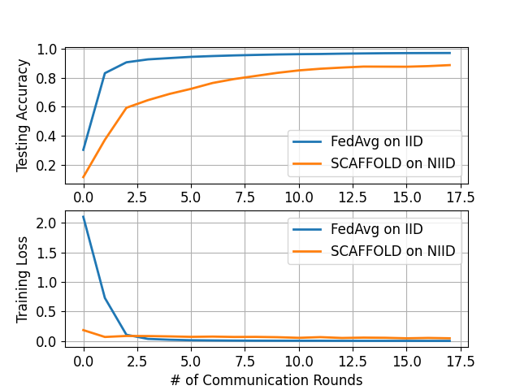

# PyTorch Implementation of Federated Learning Baselines

PyTorch-Federated-Learning provides various federated learning baselines implemented using the PyTorch framework. The codebase follows a client-server architecture and is highly intuitive and accessible.

* **Current Baseline implementations**: Pytorch implementations of the federated learning baselines. The current supported baselines are FedAvg, FedNova, FedProx and SCAFFOLD
* **Dataset preprocessing**: Downloading the benchmark datasets automatically and dividing them into a number of clients w.r.t. federated settings. The current supported datasets are MNIST, Fashion-MNIST, SVHN, CIFAR-10, CIFAR-100. Further datasets need to be downloaded manually.
* **Postprocessing**: Visualization of the training results for evaluation.


## Installation

### Dependencies

 - Python (3.8)
 - PyTorch (1.8.1)
 - OpenCV (4.5)
 - numpy (1.21.5)


### Install requirements

Run: `pip install -r requirements.txt` to install the required packages.

## Federated Dataset Preprocessing

This preprocessing aims to divide the entire datasets into a dedicated number of clients with respect to federated settings.
Depending on the the number of classes in each local dataset, the entire dataset are split into Non-IID datasets in terms of label distribution skew.


## Execute the Federated Learning Baselines

### Test Run

```
python baselines_main.py -nc 10 \
                         -ck 10 \
                         -ds 'MNIST' \
                         -md 'LeNet' \
                         -is 0 \
                         -rr 'results' \
                         -nr 500 \
                         -os 1\
                         -cis 'FedAvg' \
                         -cil 0.001 \
                         -cib 50 \
                         -cie 1 \
                         -sim 0.9 \
                         -sin 1
```


### Explanations of Arguments

- `--sys-n_client` `-nc`: Number of the clients
- `--sys-n_local_class` `-ck`: Number of the classes in each client
- `--sys-dataset` `-ds`: Dataset name, one of the following five datasets: "MNIST", "CIFAR10", "FashionMnist", "SVHN", "CIFAR100"
- `--sys-model` `-md`: Model name
- `--sys-i_seed` `-is`: Seed used in experiments
- `--sys-res_root` `-rr`: Root directory of the results
- `--sys-n_round` `-nr`: Number of global communication rounds
- `--sys-oneshot` `-os`: Ture if only run with one-shot communication, otherwise false.
  

- `--client-instance` `-cis`: Instance of federated learning algorithm used in clients: "FedAvg", "SCAFFOLD", "FedNova" and "FedProx"
- `--client-instance_lr` `-cil`: Learning rate in clients
- `--client-instance_bs` `-cib`: Batch size in clients
- `--client-instance_n_epoch` `-cie`: Number of local training epochs in clients
- `--client-instance_momentum` `-sim`: Momentum of local training in clients
- `--client-instance_n_worker` `-sin`: Number of workers in the server

### Examples

* **Example I** Run: `python baselines_main.py -nc 500 -ck 10 -ds 'MNIST' -md 'LeNet' -is 0 -rr 'results' 
-nr 18 -cis 'FedAvg' -cil 0.001 -cib 50 -cie 50 -sim 0.9 -sin 1`

* **Example II** Run SCAFFOLD on Non-IID MNIST with 500 clients:
Run: `python baselines_main.py -nc 500 -ck 2 -ds 'MNIST' -md 'LeNet' -is 0 -rr 'results' 
-nr 18 -cis 'SCAFFOLD' -cil 0.001 -cib 50 -cie 50 -sim 0.9 -sin 1`

* **Results**



## Evaluation Procedures

Please run `python postprocessing/eval_main.py -rr 'results'` to plot the testing accuracy and training loss by the increasing number of epochs or communication rounds. 
Note that the labels in the figure is the name of result files

